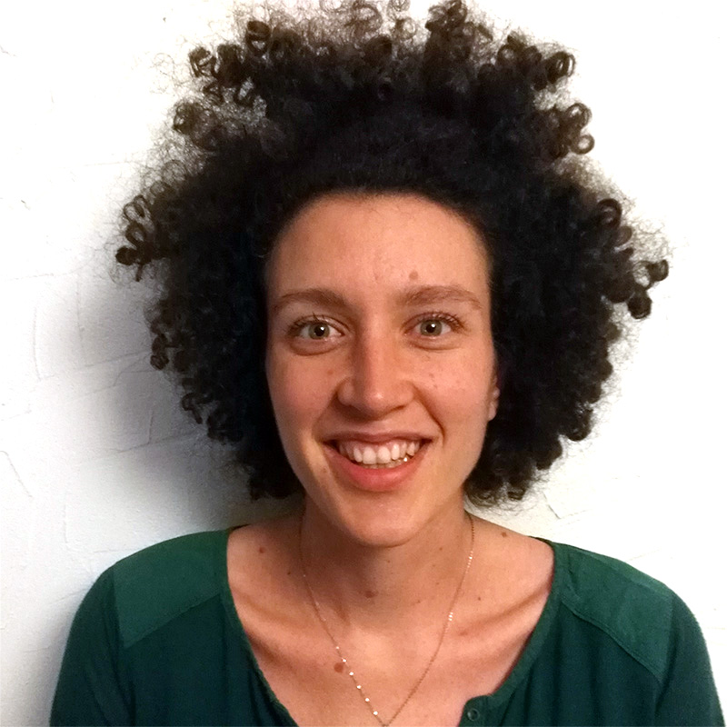

# About me

The robot that beat Garry Kasparov actually needed a human to move the chess pieces. If robots exceeds adult performance in intelligence tests, they are still at their infancy when it comes to perception or mobility. One of the reason is that the human sense of touch is far from being understood. Therefore, I decided to devote my PhD at Aix-Marseille University in this field. My research was aiming at a better understanding of the role of the sense of touch in manipulation. It received the recognition of the Eurohaptic Society PhD Award and is currently under review to be published by Springer.

After these 3 years of research on human and psychophysical studies, I started a postdoc at Delft University of Technology in the Netherlands, within the Cognitive Robotic team. My goal was to apply the result of my PhD to equip industrial robots with a gentle touch, useful to pick fruits.

I have recently been granted the Marie Curie postdoctoral fellowship to conduct my project #ReTouch for the next 3 years! Hoping that at the end of the project, a bilateral tactile telemanipulation system can bridge the gap for touch over a distance!

During my free time, I like cooking. See <a href="http://u.osmfr.org/m/520432/" onclick="LoadRunning();return false">Cooking map</a> to see some approved receipes on a map!

Big sister of 4 little cute creatures, I have many activities to share to keep them busy (visit [this page](./scientific-activities.md).)
